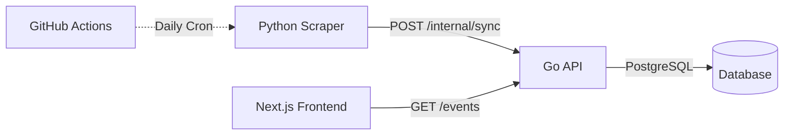

# Runners List API

> **Go-based REST API for Malaysian running events aggregation platform**

Part of the **Runners List Platform** - a microservices-ready architecture for scraping, storing, and serving running event data across Malaysia.

[](https://golang.org)
[](https://www.postgresql.org)
[](https://www.docker.com)
[](./internal/core/service)
[](./coverage.html)

---

## Table of Contents

- [Overview](#overview)
- [The Holy Trinity](#the-holy-trinity)
- [Architecture](#architecture)
- [Quick Start](#quick-start)
- [API Endpoints](#api-endpoints)
- [Development](#development)
- [Testing](#testing)
- [Deployment](#deployment)

---

## Overview

The **Runners List API** is the central hub of a three-component platform that aggregates running events across Malaysia. It provides a RESTful API for managing event data, with built-in authentication, validation, and automated data ingestion from web scrapers.

### The Holy Trinity

This API is part of a **microservices-ready architecture** consisting of three core services:



#### 1. **Python Scraper**
- **Repository**: [runners-list-scraper](https://github.com/aniqaqill/runners-list-scraper)
- **Purpose**: Extracts running event data from Malaysian event listing websites
- **Tech**: Python, Selenium, BeautifulSoup4
- **Features**:
  - Scrapes event name, date, location, state, distance
  - Automated retry logic with exponential backoff
  - Sends data to API via secure internal endpoint

#### 2. **Go API** (This Repository)
- **Repository**: [runners-list-api](https://github.com/aniqaqill/runners-list-api)
- **Purpose**: Central data hub with RESTful API for event management
- **Tech**: Go, Fiber v2, GORM, PostgreSQL
- **Features**:
  - Internal sync endpoint for scraper data ingestion
  - JWT authentication for protected routes
  - API key authentication for scraper
  - Upsert logic to prevent duplicate events
  - Hexagonal architecture (Ports & Adapters)

#### 3. **Next.js Frontend**
- **Repository**: [runners-list-web](https://github.com/aniqaqill/runners-list-web)
- **Purpose**: User-facing web application for browsing events
- **Tech**: Next.js 15, React 18, TypeScript, Tailwind CSS, Shadcn UI
- **Planned Features**:
  - Real-time event data from API
  - Search and filter by state, distance, date
  - ISR (Incremental Static Regeneration)
  - Dark mode support

---
## Architecture

### Hexagonal Architecture (Ports & Adapters)

```
runners-list-api/
├── cmd/                    # Application entry points
│   ├── main.go            # Main application
│   └── routes.go          # Route definitions
├── internal/
│   ├── adapter/           # External adapters
│   │   ├── database/      # Database connection
│   │   ├── http/          # HTTP handlers
│   │   ├── middleware/    # HTTP middleware
│   │   └── repository/    # Data persistence
│   ├── core/              # Business logic
│   │   ├── domain/        # Domain models
│   │   └── service/       # Business services
│   ├── port/              # Interface definitions
│   └── config/            # Configuration
└── pkg/                   # Shared utilities
```

### Data Model

```go
type Events struct {
    gorm.Model                    // ID, CreatedAt, UpdatedAt, DeletedAt
    Name             string       // Event name
    Location         string       // City, State
    State            string       // Malaysian state
    Distance         string       // Race distance (e.g., "21km")
    Date             time.Time    // Event date
    Description      string       // Optional description
    RegisterationURL string       // Registration link
}
```

---

## Quick Start

### Prerequisites
- Go 1.23+
- Docker & Docker Compose
- PostgreSQL (or use Docker)

### 1. Clone the Repository
```bash
git clone https://github.com/aniqaqill/runners-list-api.git
cd runners-list-api
```

### 2. Set Up Environment
```bash
cp .env.example .env
# Edit .env with your configuration
```

**Required Environment Variables**:
```env
# Database (Docker)
DB_HOST=db
DB_USER=myrunnerslist
DB_PASSWORD=myrunnerslist
DB_NAME=myrunnerslist

# JWT Secret
JWT_SECRET=your_jwt_secret_key_here

# Internal API Key (for scraper)
INTERNAL_API_KEY=your_internal_api_key_here
```

### 3. Start Development Environment
```bash
make dev-up
```

The API will be available at `http://localhost:8080`

### 4. Test the API
```bash
# Health check
curl http://localhost:8080/api/v1/

# List events
curl http://localhost:8080/api/v1/events
```

---

## API Endpoints

### Public Endpoints

| Method | Endpoint | Description |
|--------|----------|-------------|
| `GET` | `/api/v1/` | Health check |
| `GET` | `/api/v1/events` | List all events |
| `POST` | `/api/v1/register` | Create user account |
| `POST` | `/api/v1/login` | Get JWT token |

### Protected Endpoints (JWT Required)

| Method | Endpoint | Description |
|--------|----------|-------------|
| `POST` | `/api/v1/protected/events/create-events` | Create single event |
| `DELETE` | `/api/v1/protected/events/:id` | Delete event |

### Internal Endpoints (API Key Required)

| Method | Endpoint | Auth | Description |
|--------|----------|------|-------------|
| `POST` | `/api/v1/internal/sync` | `X-Internal-Token` | Bulk event sync from scraper |

#### Internal Sync Endpoint Example

**Request**:
```bash
curl -X POST http://localhost:8080/api/v1/internal/sync \
  -H "Content-Type: application/json" \
  -H "X-Internal-Token: your_api_key_here" \
  -d '{
    "events": [
      {
        "name": "Penang Bridge Run",
        "location": "Penang",
        "state": "Penang",
        "distance": "10km",
        "date": "2026-11-15",
        "registration_url": "https://example.com"
      }
    ]
  }'
```

**Response**:
```json
{
  "success": true,
  "inserted": 1,
  "updated": 0,
  "total": 1
}
```

---

## Development

If you are lazy for every command run : 

```bash
make help            # Show all commands
```

### Project Structure

- **`cmd/`** - Application entry points and route definitions
- **`internal/adapter/`** - External adapters (HTTP, database, repositories)
- **`internal/core/`** - Business logic (domain models, services)
- **`internal/port/`** - Interface definitions (ports)
- **`pkg/`** - Shared utilities

---

## Testing

### Run Tests
```bash
# All tests
make test

# Unit tests with coverage
make unit-test

# Verbose output
make test-verbose

# Generate coverage report
make coverage
```
---

## Deployment

### Docker Compose (Recommended)

**Development**:
```bash
docker compose -f docker-compose.dev.yml up --build
```

**Production**:
```bash
docker compose up --build -d
```

## Documentation

- **API Specification**: See [API Endpoints](#api-endpoints) section

---

### Development Guidelines
- Write tests for new features
- Update documentation as needed
- Run `make fmt` before committing
- Ensure all tests pass (`make test`)


**Part of the Runners List Platform** | [Scraper](https://github.com/aniqaqill/runners-list-scraper) | [API](https://github.com/aniqaqill/runners-list-api) | [Frontend](https://github.com/aniqaqill/runners-list-web)
